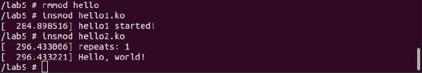
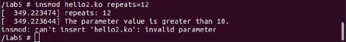
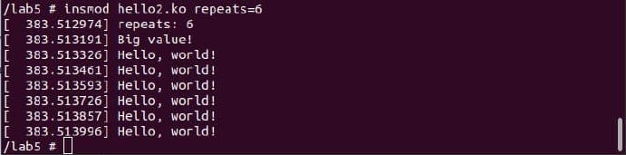
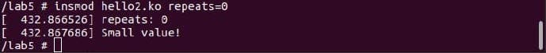

# AK-Lab-5 # 
зроблено Палехою Богданом ІО-83
Basic:

modinfo hello:

modinfo модуля hello2

запуск модуля hello2 без параметрів

запуск модуля hello2 з параметром 12

запуск модуля hello2 з параметром 6

запуск модуля hello2 з параметром 2

запуск модуля hello2 з параметром 0

dmesg

